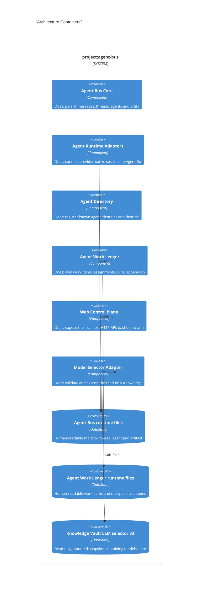

```mermaid
C4Container
  title "Architecture Containers"
  System_Boundary(boundary_project_agent_bus, "project:agent-bus") {
    Container(Component_bus_core, "Agent Bus Core", "Component", "Does: persist messages, threads, agents and artifa")
    Container(Component_agent_adapters, "Agent Runtime Adapters", "Component", "Does: connect provider-native sessions to Agent Bu")
    Container(Component_agent_directory, "Agent Directory", "Component", "Does: register known agent identities and their de")
    Container(Component_work_ledger, "Agent Work Ledger", "Component", "Does: own work items, assignments, runs, append-on")
    Container(Component_control_plane, "Web Control Plane", "Component", "Does: expose the localhost HTTP API, dashboard and")
    Container(Component_model_selector_adapter, "Model Selector Adapter", "Component", "Does: validate and expose the read-only Knowledge ")
    ContainerDb(DataStore_bus_runtime_files, "Agent Bus runtime files", "DataStore", "Human-readable mailbox, thread, agent and artifact")
    ContainerDb(DataStore_work_ledger_files, "Agent Work Ledger runtime files", "DataStore", "Human-readable work items and receipts plus append")
    ContainerDb(DataStore_llm_selector_v3, "Knowledge Vault LLM selector v3", "DataStore", "Read-only mounted snapshot containing models, acce")
  }
  Rel(Component_bus_core, DataStore_bus_runtime_files, "writes-to")
  Rel(Component_agent_directory, DataStore_bus_runtime_files, "writes-to")
  Rel(Component_work_ledger, DataStore_work_ledger_files, "writes-to")
  Rel(Component_model_selector_adapter, DataStore_llm_selector_v3, "reads-from")
```