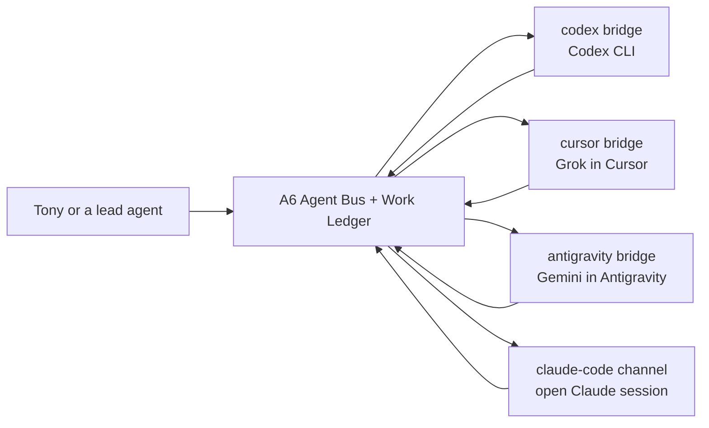

# Agent Bus: one-page operator guide

Agent Bus has one durable authority on A6. The Mac bridges connect native provider CLIs
to it. The dashboard shows the same messages, work and bridge registrations.



## Choose the target

| Target | What answers | Automatic availability | Context continuity |
|---|---|---|---|
| `codex` | Codex CLI using `gpt-5.6-sol` | persistent LaunchAgent | dedicated persistent session |
| `cursor` | Cursor Agent CLI using Grok 4.5 High | persistent LaunchAgent | one Cursor session per bus thread |
| `antigravity` | Antigravity `agy` using Gemini 3.5 Flash Medium | persistent LaunchAgent | one conversation per bus thread |
| `claude-code` | the open Claude Code channel session | only while that session is open | that Claude session |

Fable, Grok and Gemini are model choices, not agent addresses. Send to `cursor` or
`antigravity`; the bridge configuration chooses the model.

## Ask for work

From an agent with the Agent Bus skill:

```text
Use Agent Bus. Send this review to cursor, require acknowledgement and a response,
attach /absolute/path/to/draft.md and /absolute/path/to/voice.md, and report the
message ID and thread ID. Ask for findings only, not a rewrite.
```

Use `requires_response: true` for delegated action and `ack_required: true` when receipt
matters. A remote client uploads local `artifact_paths` to A6 before sending.

For independent review, send the same frozen artifact and rubric to separate targets. Do
not disclose one reviewer's findings to another. Synthesize only after all replies arrive.

## Read the evidence

- A recent heartbeat means the bridge process is running.
- `acknowledged` means the target picked up the message.
- An in-thread reply is the provider's returned result.
- Message-thread `completed` means the transport exchange finished.
- A Work Ledger item is separate: it needs assignment, run and receipt records for governed
  status, review and usage tracking.

Registration alone is not proof of delivery. When in doubt, run:

```bash
npm run bridge:test -- --target codex --target cursor --target antigravity --artifact
```

## Persistence and storage

A6 stores messages, threads, artifacts and Work Ledger records. The Mac stores only native
provider session references under `~/Library/Application Support/Agent Bus/`. Durable facts
belong in the source project or Knowledge Vault; provider chat history is useful continuity,
not the source of truth.

`~/AgentBus` is a local-development fallback only. Live Mac clients must use
`AGENT_BUS_CONTROL_PLANE_URL=http://127.0.0.1:18091/agent-bus` so a second ledger cannot
silently diverge.
