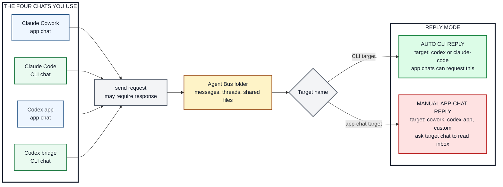

# Agent Bus: One-Page Operator Guide

Agent Bus lets Claude and Codex pass tasks through a shared local mailbox:

```text
~/AgentBus
```

Use the full guide for first-time MCP registration and troubleshooting. This page is the
daily operating model.



## The Core Rule

Any chat can send a task. The **target name** decides what happens.

| Target | Goes to | Reply mode |
| --- | --- | --- |
| `codex` | Codex bridge in Terminal | Automatic if the Codex bridge is running |
| `claude-code` | Claude Code in Terminal | Automatic if Claude Code channel is running |
| `codex-app` or custom Codex app name | Codex app chat | Manual: ask that exact chat to read its inbox |
| `cowork` or custom Claude app name | Claude Cowork chat | Manual: ask that exact chat to read its inbox |

`requires_response` means "please reply". It does not force automation. Automation only
happens when the target is `codex` or `claude-code` and that responder is running.

## Start The Terminal Chats And Bridge

Claude Code CLI chat / auto responder:

```bash
cd /path/to/agent-bus
claude --dangerously-load-development-channels server:agent-bus-channel
```

Normal Codex CLI chat:

```bash
cd /path/to/agent-bus
codex -m gpt-5.2
```

This opens the normal Codex CLI chat. It is a separate manual chat unless you tell it to
use Agent Bus and read a named inbox.

Codex bridge setup and auto responder:

```bash
cd /path/to/agent-bus
node src/codex-bridge.mjs --model gpt-5.2
```

This command is the Codex bridge setup. It creates or resumes the persistent Codex bridge
session, stores it in `~/AgentBus/_codex_bridge_session.json`, watches
target `codex`, and opens an `agent-bus>` prompt into that same session. Leave this
Terminal running while you want `codex` to auto reply.

The bridge does not open the normal Codex CLI chat screen. It has its own visible prompt:
`agent-bus>`. Typing there goes into the same persistent Codex CLI session that handles
messages sent to target `codex`.

## Name A Specific App Chat

You name an app chat by giving it an Agent Bus address inside that chat. Open the exact
chat and paste:

```text
Use the agent-bus skill.
For this conversation, your Agent Bus address is codex-review-chat.
When I ask you to check Agent Bus, read inbox codex-review-chat, handle actionable
messages, reply in the same thread, mark messages read, and update thread status.
Confirm the address you will use.
```

Then route work to `codex-review-chat`. Because it is an app chat, it remains manual: ask
that same chat to read its inbox when you want it to act.

## Send Work

To ask the Codex auto responder from Claude:

```text
Use the agent-bus skill. Send this task to codex and require a response: review the test plan.
```

To ask Claude Code from Codex:

```text
Use the agent-bus skill. Send this task to claude-code and require a response: check the wording.
```

To use a named app chat:

```text
Use the agent-bus skill. Send this task to codex-review-chat and require a response.
```

Then, in that named app chat:

```text
Use the agent-bus skill. Read inbox codex-review-chat and respond.
```

Put larger files in `~/AgentBus/shared` and include the absolute path
in the message.
